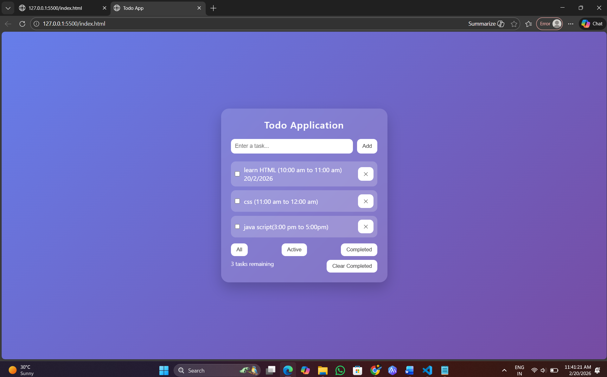

# Ex03 To-Do List using JavaScript
## Date:20/2/2026

## AIM
To create a To-do Application with all features using JavaScript.

## ALGORITHM
### STEP 1
Build the HTML structure (index.html).

### STEP 2
Style the App (style.css).

### STEP 3
Plan the features the To-Do App should have.

### STEP 4
Create a To-do application using Javascript.

### STEP 5
Add functionalities.

### STEP 6
Test the App.

### STEP 7
Open the HTML file in a browser to check layout and functionality.

### STEP 8
Fix styling issues and refine content placement.

### STEP 9
Deploy the website.

### STEP 10
Upload to GitHub Pages for free hosting.

## PROGRAM

```
## index.html

<!DOCTYPE html>
<html lang="en">
<head>
    <meta charset="UTF-8">
    <title>Todo App</title>
    <link rel="stylesheet" href="style.css">
</head>
<body>

<div class="container">
    <h2>Todo Application</h2>

    <div class="input-section">
        <input type="text" id="taskInput" placeholder="Enter a task...">
        <button id="addBtn">Add</button>
    </div>

   <ul id="taskList"></ul>

    <div class="filters">
        <button data-filter="all">All</button>
        <button data-filter="active">Active</button>
        <button data-filter="completed">Completed</button>
    </div>

    <div class="bottom">
        <span id="taskCount"></span>
        <button id="clearCompleted">Clear Completed</button>
    </div>
</div>

<script src="script.js"></script>
</body>
</html>

```
```
## style.css

/* Modern Professional Todo App UI */

* {
    margin: 0;
    padding: 0;
    box-sizing: border-box;
}

body {
    font-family: 'Segoe UI', sans-serif;
    background: linear-gradient(135deg, #667eea, #764ba2);
    height: 100vh;
    display: flex;
    justify-content: center;
    align-items: center;
}

.container {
    width: 420px;
    background: rgba(255, 255, 255, 0.15);
    backdrop-filter: blur(15px);
    padding: 25px;
    border-radius: 20px;
    box-shadow: 0 15px 35px rgba(0, 0, 0, 0.2);
    color: white;
}

h2 {
    text-align: center;
    margin-bottom: 20px;
    font-weight: 600;
    letter-spacing: 1px;
}

.input-section {
    display: flex;
    gap: 10px;
    margin-bottom: 20px;
}

input {
    flex: 1;
    padding: 10px;
    border: none;
    border-radius: 10px;
    outline: none;
    font-size: 14px;
}

button {
    padding: 8px 14px;
    border: none;
    border-radius: 10px;
    background: #ffffff;
    color: #333;
    font-weight: 500;
    cursor: pointer;
    transition: all 0.3s ease;
}

button:hover {
    background: #222;
    color: white;
    transform: scale(1.05);
}

ul {
    list-style: none;
    margin-bottom: 15px;
}

li {
    background: rgba(255, 255, 255, 0.2);
    padding: 10px;
    margin-bottom: 10px;
    border-radius: 12px;
    display: flex;
    justify-content: space-between;
    align-items: center;
    transition: 0.3s ease;
}

li:hover {
    transform: translateX(5px);
}

.completed {
    text-decoration: line-through;
    opacity: 0.6;
}

.filters {
    display: flex;
    justify-content: space-between;
    margin-bottom: 10px;
}

.bottom {
    display: flex;
    justify-content: space-between;
    font-size: 14px;
}
```

```
## script.js

let tasks = JSON.parse(localStorage.getItem("tasks")) || [];
let currentFilter = "all";

const taskInput = document.getElementById("taskInput");
const taskList = document.getElementById("taskList");
const addBtn = document.getElementById("addBtn");
const taskCount = document.getElementById("taskCount");
const clearCompletedBtn = document.getElementById("clearCompleted");

addBtn.addEventListener("click", addTask);
taskInput.addEventListener("keypress", function(e) {
    if (e.key === "Enter") addTask();
});

document.querySelectorAll(".filters button").forEach(button => {
    button.addEventListener("click", () => {
        currentFilter = button.dataset.filter;
        renderTasks();
    });
});

clearCompletedBtn.addEventListener("click", clearCompleted);

function saveTasks() {
    localStorage.setItem("tasks", JSON.stringify(tasks));
}

function addTask() {
    if (taskInput.value.trim() === "") return;

    tasks.push({
        id: Date.now(),
        text: taskInput.value,
        completed: false
    });

    taskInput.value = "";
    saveTasks();
    renderTasks();
}

function deleteTask(id) {
    tasks = tasks.filter(task => task.id !== id);
    saveTasks();
    renderTasks();
}

function toggleTask(id) {
    tasks = tasks.map(task =>
        task.id === id ? { ...task, completed: !task.completed } : task
    );
    saveTasks();
    renderTasks();
}

function clearCompleted() {
    tasks = tasks.filter(task => !task.completed);
    saveTasks();
    renderTasks();
}

function renderTasks() {
    taskList.innerHTML = "";

    let filteredTasks = tasks;

    if (currentFilter === "active") {
        filteredTasks = tasks.filter(task => !task.completed);
    } else if (currentFilter === "completed") {
        filteredTasks = tasks.filter(task => task.completed);
    }

    filteredTasks.forEach(task => {
        const li = document.createElement("li");

        li.innerHTML = `
    <div style="display:flex; align-items:center; gap:10px;">
        <input type="checkbox" ${task.completed ? "checked" : ""}
            onclick="toggleTask(${task.id})">
        <span class="${task.completed ? 'completed' : ''}">
            ${task.text}
        </span>
    </div>
    <button onclick="deleteTask(${task.id})">✕</button>
`;

        taskList.appendChild(li);
    });

    taskCount.textContent =
        tasks.filter(task => !task.completed).length + " tasks remaining";
}

renderTasks();


```
## OUTPUT


## RESULT
The program for creating To-do list using JavaScript is executed successfully.
